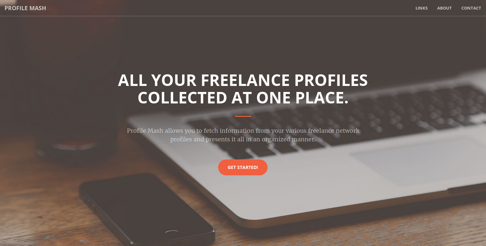

# Profile Mash

## Live Hosts

The app is not yet deployed, it will be deployed soon.

## Motivation

Freelancing is common among the professionals and there are many platforms for the same. One can get work based on his profile containing past works, which develops over time making it hard to shift to another platform.

## Description

To solve this problem we designed the Profile Mash where you can enter the links to one or more freelancing platforms and it creates a common profile which can be shown to the client.

The above image is the landing page for the app.

## Technologies Used

* Node.Js - for server side programming.
* Cheerio.Js - for web-scrapping and getting the data from the user profiles.
* Express.Js - for routing.
* HTML/CSS - for client-side programming
* Bootstrap - for styling
* jQuery - for animation
